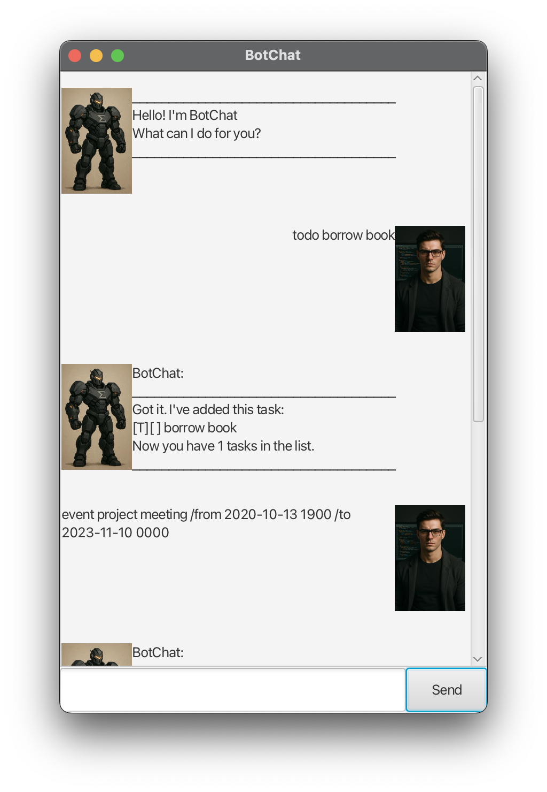

# BotChat User Guide




## Welcome to **BotChat**, your simple task-managing chatbot!  
### BotChat helps you keep track of your todo tasks, deadlines and events in a easy way.

## Adding Todo tasks

Adds a task with a description.

BotChat will remember this task and show the due date when you list it.

Usage: `todo <description>`

Example: `todo borrow book`


```
Got it. I've added this task:
[T][] return book
Now you have 2 tasks in the list.
```


## Adding Deadlines

Adds a task with a specific deadline. 

BotChat will remember this task and show the due date when you list it.

Usage: `deadline <description> /by <date yyyy-MM-dd>`

Example: `deadline return book /by 2023-01-01`


```
Got it. I've added this task:
[D][] return book (by: Jan 01 2023 )
Now you have 3 tasks in the list.
```

## Adding Events

Adds a task that spans a specific time range.

BotChat will remember the start and end date & time.

Usage: `event <description> /from <datetime yyyy-MM-dd HHmm> 
        /to <datetime yyyy-MM-dd HHmm>`

Example: `event project /from 2020-10-13 1900 /to 2024-11-10 0000`


```
Got it. I've added this task:
[E][] project (from: Oct 13 2020 7:00pm to:Nov 10 2024 12:00am )
Now you have 4 tasks in the list.
```


## Adding DoAfter Tasks

Adds a task that has to be done after a condition.

BotChat will remember the condition.

Usage: `doafter <description> /after <condition>`

Example: `doafter return book /after reading book`


```
Got it. I've added this task:
[B][] return book (After: reading book)
Now you have 5 tasks in the list.
```
## List tasks

Lists all the tasks that have been added in order.

First task added is listed first.


Usage: `list`

```
Here are the tasks in your list:
1. [E][] project (from: Oct 13 2020 7:00pm to:Nov 10 2024 12:00am )
2. [B][X] return book (After: reading book)
```

## Mark a task as Done

Marks a specific task as completed, using its task number.


Usage: `mark <task-index>`

Example: `mark 2`


```
Nice! I've marked this task as done:
[B][X] return book (After: reading book)
```

## Unmark a task as Done

Unmarks a task as done, using its task number.


Usage: `unmark <task-index>`

Example: `unmark 2`


```
OK, I've unmarked this task as done yet:
[B][] return book (After: reading book)
```

## Deleting a task

Removes a specific task, using its task number.


Usage: `delete <task-index>`

Example: `delete 2`


```
Noted. I've removed this task:
[B][] return book (After: reading book)
Now you have 4 tasks in the list.
```

## Finding a task

Finding a specific task containing a specific keyword.


Usage: `find <keyword>`

Example: `find book`


```
Here are the matching tasks in your list:
1.[T][] borrow book
2.[D][] return book (by: Jan 01 2023)
```

## Closing the bot

Close the bot after using it

Usage: `bye`
